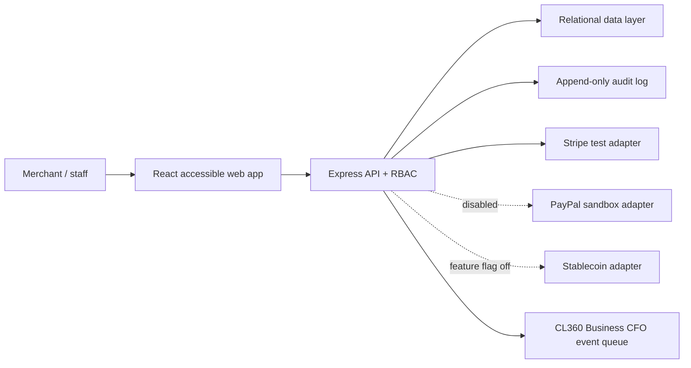

# CL360 xPay™ MVP

AI-powered payment operations for CareerLift360 LLC: consultants, creators, ADA services, expert-witness engagements, and CL360 Music.

Production home: [www.cl360ai.com](https://www.cl360ai.com). The public xPay experience is designed for `https://www.cl360ai.com/xpay`.

This repository is a working sandbox MVP. It is **not a bank, wallet, cryptocurrency, money transmitter, or production payment processor**. It has no affiliation with Elon Musk, X Corp., or the X platform. No token is issued or planned by this MVP. Stripe accepts **test keys only**; PayPal and crypto modules are disabled until explicitly configured.

## What is included

- Polished, ADA-conscious responsive dashboard and landing experience
- Merchant-onboarding API boundary
- Payment links with simulated mode and optional Stripe Checkout test mode
- Invoice, customer, transaction, and dashboard foundations
- Role checks for admin, finance, support, and viewer access
- Append-only audit-event foundation
- PayPal sandbox adapter boundary (disabled placeholder)
- Stablecoin/crypto boundary behind an off-by-default feature flag
- CL360 Business CFO event integration point
- Read-only custom GPT Actions integration package for CL360 xPay Finance Guard™
- Deployment-time customer-data kill switch (`CUSTOMER_DATA_ENABLED=false`)
- Prisma schema ready for local SQLite development and straightforward Postgres migration
- Secure headers, constrained CORS, input limits, generic errors, and explicit sandbox status

## Stack

React 19 + TypeScript + Vite, Express, Stripe SDK, Helmet, and a Prisma-compatible relational schema. The UI and API are separate layers so provider credentials never enter the browser.

## Quick start

Prerequisites: Node.js 20+ and npm.

```bash
npm install
copy .env.example .env
npm run dev
```

Open `http://localhost:5173` for the dashboard or `http://localhost:5173/xpay` for the public landing page. The API listens on `http://localhost:8787`; `GET /api/health` confirms provider flags.

To exercise real Stripe test Checkout, add an `sk_test_...` key to `.env`. Live keys are rejected. Without a key, payment links are safely simulated.

For the public sandbox at `https://api.cl360ai.com`, follow [`docs/DEPLOYMENT.md`](./docs/DEPLOYMENT.md). The included `render.yaml` keeps Stripe Checkout, GPT Actions, PayPal, and crypto disabled on the initial deployment.

## Commands

```bash
npm run dev       # web + API with reload
npm run check     # strict TypeScript validation
npm run build     # production frontend build
npm start         # API only
```

## Environment

Copy [.env.example](./.env.example). Never commit `.env`. Important controls:

- `DEMO_AUTH=true` keeps the MVP demo identity enabled. Replace it with OIDC/Auth0/Clerk/Entra before any pilot.
- `STRIPE_SECRET_KEY` must begin with `sk_test_`.
- `PAYPAL_ENV=sandbox`; the route remains a placeholder in this phase.
- `CRYPTO_PAYMENTS_ENABLED=false` is the safe default. Turning it on still does not implement custody or transfers.
- `CFO_WEBHOOK_URL` is reserved for signed, asynchronous Business CFO events.

## Architecture



Production evolution: deploy the web app behind a CDN/WAF; run the API in a private service; use managed Postgres, KMS-backed secrets, a queue for webhooks, object storage for invoice PDFs, and an external identity provider with MFA.

## API routes

| Method | Route | Role | Purpose |
|---|---|---|---|
| GET | `/api/health` | Public | Sandbox/provider readiness |
| GET | `/api/dashboard` | Admin, finance, viewer | Summary metrics |
| POST | `/api/merchants/onboarding` | Admin | Start merchant record |
| POST | `/api/customers` | Admin, finance | Create customer |
| POST | `/api/invoices` | Admin, finance | Create draft invoice |
| POST | `/api/payment-links` | Admin, finance | Simulated or Stripe test checkout |
| GET | `/api/audit-logs` | Admin | Recent audit activity |
| POST | `/api/integrations/cfo/events` | Admin, finance | Queue CFO event |
| POST | `/api/paypal/orders` | — | Disabled sandbox boundary |
| POST | `/api/crypto/checkout` | — | Disabled feature-flag boundary |
| GET | `/api/gpt/finance-summary` | GPT bearer key | Read-only sandbox summary |
| GET | `/api/gpt/invoices` | GPT bearer key | Minimized sandbox invoice list |
| GET | `/api/gpt/customers` | GPT bearer key | Privacy-minimized customer list |

The temporary role middleware reads `x-demo-role`; it is for local demonstration only. Production must derive roles from a verified server-side session/JWT, enforce workspace scoping on every query, and add CSRF protection where cookie sessions are used.

## Security and compliance guardrails

- Payment card data must always be collected on provider-hosted fields/Checkout; CL360 servers should never receive PAN or CVV.
- Stripe webhook payloads are accepted only after official signature verification against the untouched raw request body; live-mode events are rejected.
- Do not enable live payments until legal entity, tax, refund, privacy, terms, dispute, sanctions, and merchant-underwriting workflows are approved.
- ADA/WCAG work includes semantic landmarks, keyboard navigation, visible focus support, a skip link, reduced-motion handling, responsive layouts, and status text that does not rely on color alone. A formal WCAG 2.2 AA audit is still required before launch.
- Expert-witness and healthcare descriptions must not contain privileged information or PHI. This MVP is not a HIPAA system.
- Stablecoin acceptance needs jurisdiction-specific legal review, sanctions screening, tax treatment, wallet/custody decisions, and provider diligence. The recommended first implementation is non-custodial provider checkout and USDC only.
- Audit logs must become immutable, workspace-scoped, retained under policy, and exported to security monitoring.
- Add rate limiting, idempotency keys, signed webhook verification, dependency scanning, SAST/DAST, backups, incident response, and penetration testing before production.

## Database

The schema is in [`prisma/schema.prisma`](./prisma/schema.prisma). Monetary values are integer minor units (cents), never floating-point. For the next phase, add Prisma packages, generate a migration, seed a test workspace, and replace the in-memory demo results in `server/index.ts` with repository queries.

## Roadmap

1. **MVP foundation (current):** dashboard, workflow shells, schema, role boundaries, audit foundation, Stripe test adapter.
2. **Pilot readiness:** real authentication/MFA, Postgres repositories, verified Stripe webhooks, idempotency, invoice delivery/PDFs, refunds, reconciliation, automated accessibility and security tests.
3. **Business CFO:** signed event queue, ledger mapping, cash-flow insights, tax-ready exports, anomaly alerts, approval workflows.
4. **Provider expansion:** PayPal sandbox implementation, ACH, subscriptions, carefully scoped merchant onboarding and support tooling.
5. **Optional stablecoin pilot:** legal approval, provider due diligence, USDC testnet/non-custodial checkout, transaction monitoring, accounting treatment. No proprietary token.
6. **Production launch:** compliance sign-off, PCI SAQ validation, disaster recovery, observability, penetration test, live-key change control, staged merchant rollout.

## Branding and legal note

CL360 xPay™ is presented as a CareerLift360 LLC product concept. Trademark availability has not been established; complete a professional clearance search before public launch. The product should always be described as payment-operations software powered by regulated third-party processors, not as a bank or regulated financial institution unless and until appropriately licensed.
